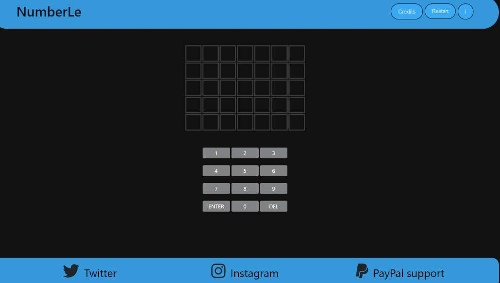
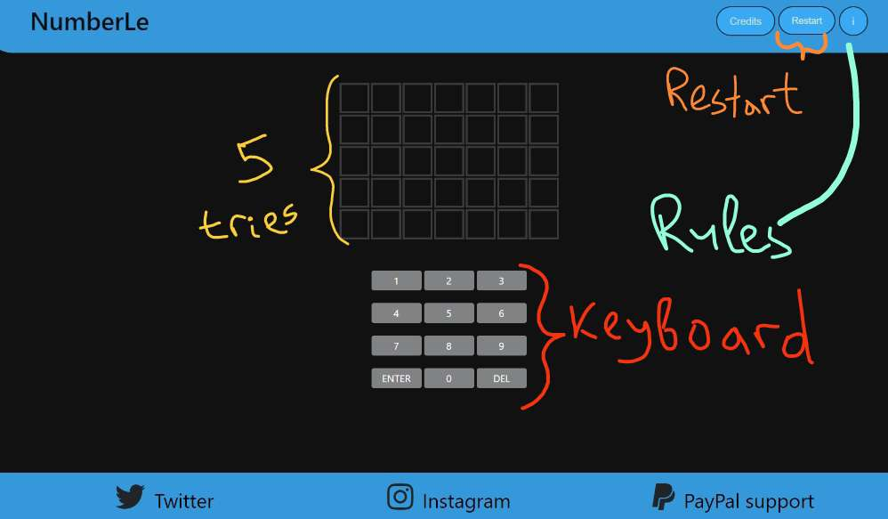

# 🎲 NumberLe

 - NumberLe is a game where the player is given 5 tries to guess a randomly generated 5-digit number.

## 💼 Structure

## 🎮 Gameplay

1. The player inputs a 5-digit number and clicks the "Guess" button.
2. The system will check the player's input and provide feedback on the number's accuracy:
    - 🟢 Green: the number is in the correct position
    - 🟡 Yellow: the number is in the generated number but in the wrong position
    - ⚫ Black: the number is not in the generated number
3. The player has 5 tries to correctly guess the generated number.

## 🛠️ Built With

-  HTML
-  CSS
-  JavaScript

## 🙇‍♂️ Author

- **Demetrios Vlassis**
